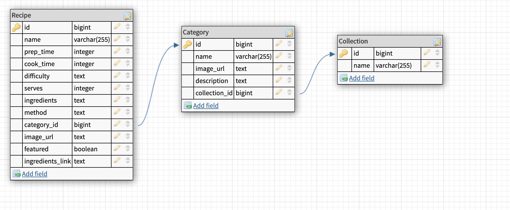

# README

## Description
First ever project working with postgresql and ruby on rails.

Generated a database with recipes, attempting to recreate Coles online website

## Features
Generated 3 tables using rails generate scaffold method

Models contain relevant associations

Nested resources , i.e routes are only available by other routes

Modified views to include nested attributes.

